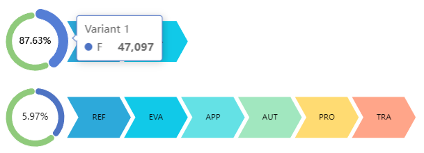

# ORCA: Organ Retrieval and (Information) Collection Analytics
## Table of Contents
<!-- TOC -->
* [ORCA: Organ Retrieval and (Information) Collection Analytics](#orca-organ-retrieval-and-information-collection-analytics)
  * [Table of Contents](#table-of-contents)
  * [Introduction: Analyzing and Visualizing the Organ Donation Process](#introduction-analyzing-and-visualizing-the-organ-donation-process)
    * [The Dataset](#the-dataset)
    * [Extraction of the Event Log](#extraction-of-the-event-log)
  * [Installation](#installation)
    * [Prerequisites](#prerequisites)
    * [Acquire the raw dataset](#acquire-the-raw-dataset)
    * [Build and run the dashboard](#build-and-run-the-dashboard)
  * [User Interface](#user-interface)
    * [Overview](#overview)
      * [Download the Event Log](#download-the-event-log)
    * [Tiles](#tiles)
  * [Features and Functions](#features-and-functions)
    * [Filtering](#filtering)
    * [Downloading Visualizations](#downloading-visualizations)
    * [Available Visualizations](#available-visualizations)
      * [Variants](#variants)
      * [Distribution](#distribution)
      * [KPIs](#kpis)
      * [DFG](#dfg)
      * [De-Jure Process](#de-jure-process)
  * [Troubleshooting](#troubleshooting)
  * [Glossary](#glossary)
  * [References](#references)
<!-- TOC -->

## Introduction: Analyzing and Visualizing the Organ Donation Process
This is a web-based dashboard for a M.Sc. student project at RWTH university. It is a dashboard written in VueJS and Flask that shows KPIs for Organ Donation Process. 
The dataset **"Organ Retrieval and Collection of Health Information for Donation" (ORCHID, Adam. H et. al.)** is supplied by PhysioNet and accessible on https://physionet.org/content/orchid/1.0.0/.

### The Dataset
The ORCHID dataset contains information about the organ donation process.
It covers ten years of clinical, financial, and administrative information from six organ procurement organizations (OPOs) in the United States.
The dataset is structured based on the standard procedure of organ procurement at an OPO. 
The procurement process consists of six main stages: referral, evaluation, approach, authorization, procurement, and transplant:

1. Referral: When a hospitalized patient is in critical condition, the hospital refers them to the local OPO for potential organ donation.
2. Evaluation: The OPO assesses each referral, conducting an initial evaluation of the patient's suitability for organ donation.
3. Approach: If the referred patient is found medically suitable, a representative from the OPO approaches the patient's next-of-kin (NOK) to seek their consent for donation.
4. Authorization: Upon obtaining consent, the OPO oversees the procurement of transplant-ready organs from the deceased patient.
5. Procurement: The OPO presents each obtained organ to individuals on the national transplant waitlist, prioritizing recipients based on the ranking established by the Organ Procurement and Transplantation Network (OPTN). The organ is assigned to the highest-ranked patient whose transplant surgeon accepts the offer.
6. Transplant: Finally, the OPO manages the logistics of transporting the organ to the recipient's transplant center, facilitating the transplant procedure.

To adhere to the Health Insurance Portability and Accountability Act (HIPAA) standards, all data underwent de-identification through structured data cleansing and date shifting. 
This involved eliminating all eighteen identifiable data elements specified in HIPAA, such as patient name, address, and dates. 
For patients aged 89 and above, their precise age was concealed, and they are represented in the dataset with an age of 100. 
Dates were systematically shifted into the future with a random offset for each individual patient. 
It is important to note that the date-shifting process maintained intervals, ensuring, for example, the preservation of the time span between death and the Organ Procurement Organization (OPO) approach for each patient.

In total, the dataset covers 133,101 deceased donor referrals and 8,972 organ donations across 13 states. For each patient, the dataset contains information about the patient and the process data (flags that indicate if the patient was approached, authorized, etc. and timestamps for these events).
Listed below are the attributes that are available for each patient. For more information, please see the [data description](https://physionet.org/content/orchid/1.0.0/data_description.html):

| Column                   | Description                                                              |
|--------------------------|--------------------------------------------------------------------------|
| `PatientID`              | A unique identifier for each patient. We use this as the case id.        |
| `OPO`                    | The OPO that is responsible for the patient.                             |
| `HospitalID`             | The hospital where the patient was treated.                              |
| `Age`                    | The age of the patient.                                                  |
| `Gender`                 | The gender of the patient.                                               |
| `Race`                   | The race of the patient.                                                 |
| `brain_death`            | Indicates whether the patient experienced brain death.                   |
| `Referral_Year`          | The year of patient referral.                                            |
| `Referral_DayofWeek`     | The day of the week of patient referral.                                 |
| `Cause_of_Death_UNOS`    | The cause of death according to UNOS (United Network for Organ Sharing). |
| `Mechanism_of_Death`     | UNOS defined mechanism of death.                                         |
| `Circumstances_of_Death` | UNOS defined circumstances of death.                                     |
| `outcome_heart`          | Outcome for the heart organ.                                             |
| `outcome_liver`          | Outcome for the liver organ.                                             |
| `outcome_kidney_left`    | Outcome for the left kidney organ.                                       |
| `outcome_kidney_right`   | Outcome for the right kidney organ.                                      |
| `outcome_lung_left`      | Outcome for the left lung organ.                                         |
| `outcome_lung_right`     | Outcome for the right lung organ.                                        |
| `outcome_pancreas`       | Outcome for the pancreas organ.                                          |

### Extraction of the Event Log
The raw dataset contains one row for each patient. The row contains information about the patient and process data (flags that indicate if the patient was approached, authorized, etc. and timestamps for these events).
To analyze the process, we need to extract an event log from the raw dataset. The event log contains one row for each event. The row contains information about the patient and the event (e.g., timestamp, event type).
We use the patient id as the case id and the event type as the activity name. We rename the columns to match the standard format of an event log.

| Column              | Description                                                                                 |
|---------------------|---------------------------------------------------------------------------------------------|
| `case:concept:name` | A unique identifier for each case. We use the patient id.                                   |
| `event:timestamp`   | The timestamp of the event.                                                                 |
| `concept:name`      | The name of the event (activity). We use the six main stages of the organ donation process. |

In addition, we also rename the other columns to be a bit more consistent. Please see the table [here](https://kacikgoez.github.io/ProcessDiscovery/event_log_extraction/#patients) for more information.

However, the raw dataset contains no timestamps for the events "Evaluation" and "Transplant". 
Therefore, we assume that these events happen one minute after the previous event. This is a simplification, but it is sufficient for our purposes, and ensures that the events are in the correct order.
If timestamps for the other events are missing, we filter out the corresponding cases. This is because we cannot determine the correct order of the events if timestamps are missing.
This attributes to roughly 3000 cases that are filtered out.

The event log will be automatically extracted when you run the dashboard for the first time. After that, the event log will be stored in the folder `backend/data/processed/`.
You can also download the event log on the [dashboard](#download-the-event-log). The event log will be downloaded as a CSV file.

## Installation
### Prerequisites
You can easily run the dashboard on your local machine using Docker. Make sure you have Docker installed on your machine. If you don't have Docker installed, you can download it here: https://www.docker.com/products/docker-desktop.
In addition, you need to have a reasonably modern browser installed. The dashboard was tested with the latest versions of Chrome, Firefox and Safari.

### Acquire the raw dataset
The raw dataset is not included in this repository as it is a restricted dataset.
You can download it from https://physionet.org/content/orchid/1.0.0/.
For that, you need to create an account on PhysioNet and agree to the data use agreement. After that, you can download the dataset as a zip file.
Unzip the file and place the content in the folder `backend/data/raw/`. The folder structure should look like this:
```
backend/data/raw/
├── .gitignore
├── calc_deaths.csv
├── data_description.html
├── LICENSE.txt
├── opd.csv
└── SHA256SUMS.txt
```
Note that for the dashboard to work, you only need the file `opd.csv`. The other files are not used. Please do not rename the file.

The raw dataset will automatically be processed when you run the dashboard for the first time. This may take a few minutes.

### Build and run the dashboard
To build and run the dashboard, open a terminal and navigate to the root folder of the project. Then run the following command:
```shell
docker-compose up --build
```
This will build the docker images and run the dashboard. You can access the dashboard on http://localhost:80.

## User Interface
### Overview
#### Download the Event Log
You can download the event log as a CSV file by clicking on the button "Download Event Log" in the top right corner of the dashboard. The event log will be downloaded as a CSV file.
The event log contains a row for each event. The row contains information about the patient and the event (e.g., timestamp, event type). See [here](#extraction-of-the-event-log) for more information.
You can use the event log to analyze the process using other tools such as ProM or PM4Py.

### Tiles

## Features and Functions
### Filtering
You can filter the event log for each visualization individually. By default, the event log is not filtered. You can filter the event log by clicking on the filter icon in the top right corner of the visualization.
Here you can add one or more filters. Each filter consists of an attribute, an operator, and a value. For the attribute, you can choose from the attributes that are available for each patient (see [here](#the-dataset) for more information). 
Note that we treat all attributes except the patients age as categorical attributes. For the operator, you can choose from the following operators (depending on the attribute type):

| Operator               | Attribute Type | Value    | Description                                          |
|------------------------|----------------|----------|------------------------------------------------------|
| IS EMPTY               | Both           | None     | The attribute is empty.                              |
| IS NOT EMPTY           | Both           | None     | The attribute is not empty.                          |
| EQUALS                 | Both           | Single   | The attribute equals the value.                      |
| NOT EQUALS             | Both           | Single   | The attribute does not equal the value.              |
| CONTAINS               | Categorical    | Multiple | The attribute contains the value.                    |
| NOT CONTAINS           | Categorical    | Multiple | The attribute does not contain the value.            |
| LESS THAN              | Numerical      | Single   | The attribute is less than the value.                |
| LESS THAN OR EQUALS    | Numerical      | Single   | The attribute is less than or equal to the value.    |
| GREATER THAN           | Numerical      | Single   | The attribute is greater than the value.             |
| GREATER THAN OR EQUALS | Numerical      | Single   | The attribute is greater than or equal to the value. |

Depending on the operator, you must enter none, one, or multiple values. For example, if you choose the operator "CONTAINS", you must enter multiple values.

You can add multiple filters. The event log will be filtered for all filters. The filters are combined with the logical operator "AND".

### Downloading Visualizations
You can download each visualization as a PNG file by clicking on the download icon in the top right corner of the tile.

### Available Visualizations
#### Variants
You can get an overview of the variants of the process by using the "Variants" visualization.
This visualization lists all variants of the process. A variant is a sequence of events that occurred in the process.


Each variant is represented by a chevron diagram. The chevron diagram shows the sequence of events for each variant.
The activity names are abbreviated to fit the diagram. You can hover over the diagram to see the full activity name.
On the right side of the diagram, you can see a pie chart that shows the number of cases for each variant based on the selected disaggregation attribute.
If you hover over a pie chart, you can see the number of cases for each variant for the corresponding disaggregation attribute value.
In addition, in the middle of the pie chart the overall percentage how often the variant occurs is shown.
Note that the variants are sorted in descending order based on the overall percentage how often the variant occurs.

#### Distribution


#### KPIs

#### DFG

#### De-Jure Process

## Troubleshooting

## Glossary
**ORCA**: The name of the dashboard. It stands for Organ Retrieval and (Information) Collection Analytics.

**ORCHID**: The name of the raw dataset. It stands for Organ Retrieval and Collection of Health Information for Donation. It is supplied by PhysioNet and accessible on https://physionet.org/content/orchid/1.0.0/.

**OPO**: Organ Procurement Organization. An organization that is responsible for the organ donation process.

**NOK**: Next-of-kin. The next-of-kin is the closest living relative of a patient. The next-of-kin is responsible for making medical decisions for the patient if they are unable to do so.

**HIPAA**: Health Insurance Portability and Accountability Act. A law that protects the privacy of patients' health information.

**UNOS**: United Network for Organ Sharing. A non-profit organization that manages the nation's organ transplant system under contract with the federal government. UNOS maintains the national transplant waiting list, matching donors to recipients 24 hours a day, 365 days a year. 

**Referral**: The patient is referred to the OPO. This happens when the patient is in critical condition and the hospital refers them to the local OPO for potential organ donation. This event is always present for each patient and a timestamp is available.

**Evaluation**: The patient is evaluated by the OPO. This happens when the OPO assesses each referral, conducting an initial evaluation of the patient's suitability for organ donation. This event is always present for each patient. However, no timestamp is available. Therefore, we assume that the event happens one minute after the previous event (Referral).

**Approach**: The OPO approaches the patient. This happens when a representative from the OPO approaches the patient's next-of-kin (NOK) to seek their consent for donation. In the dataset, a flag is available that indicates if the patient was approached. If the patient was approached, a timestamp is available.

**Authorization**: The patient is authorized for organ donation. This happens when the OPO obtains consent from the NOK for donation. In the dataset, a flag is available that indicates if the patient was authorized. If the patient was authorized, a timestamp is available.

**Procurement**: The organs are procured. This happens when the OPO oversees the procurement of transplant-ready organs from the deceased patient. In the dataset, a flag is available that indicates if the organs were procured. If the organs were procured, a timestamp is available.

**Transplant**: The organs are transplanted. This happens when the OPO manages the logistics of transporting the organ to the recipient's transplant center, facilitating the transplant procedure. In the dataset, a flag is available that indicates if the organs were transplanted. However, no timestamp is available. Therefore, we assume that the event happens one minute after the previous event (Procurement).

**Event**: An event is an action that happens during the organ donation process. The events are Referral, Evaluation, Approach, Authorization, Procurement, and Transplant. The events should happen in the above order. However, the dataset contains some inconsistencies. For example, there are cases where the patient was authorized before the patient was approached. Each event has a timestamp and a type (e.g., Referral, Evaluation, etc.) and corresponds to a case (patient) in the event log.

## References
1. Adam, H., Suriyakumar, V., Pollard, T., Moody, B., Erickson, J., Segal, G., Adams, B., Brockmeier, D., Lee, K., McBride, G., Ranum, K., Wadsworth, M., Whaley, J., Wilson, A., & Ghassemi, M. (2023). Organ Retrieval and Collection of Health Information for Donation (ORCHID) (version 1.0.0). PhysioNet. https://doi.org/10.13026/eytj-4f29.
2. Goldberger, A., Amaral, L., Glass, L., Hausdorff, J., Ivanov, P. C., Mark, R., ... & Stanley, H. E. (2000). PhysioBank, PhysioToolkit, and PhysioNet: Components of a new research resource for complex physiologic signals. Circulation [Online]. 101 (23), pp. e215–e220.