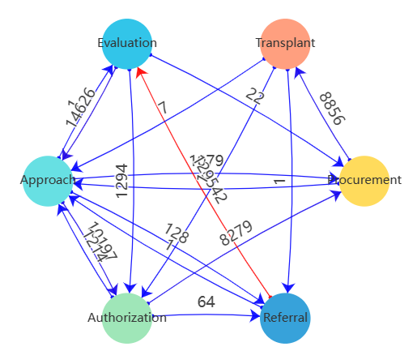

# ORCA: Organ Retrieval and (Information) Collection Analytics
## Table of Contents
<!-- TOC -->
* [ORCA: Organ Retrieval and (Information) Collection Analytics](#orca-organ-retrieval-and-information-collection-analytics)
  * [Table of Contents](#table-of-contents)
  * [Introduction: Analyzing and Visualizing the Organ Donation Process](#introduction-analyzing-and-visualizing-the-organ-donation-process)
    * [Background](#background)
    * [The Dataset](#the-dataset)
    * [Extraction of the Event Log](#extraction-of-the-event-log)
  * [Installation](#installation)
    * [Prerequisites](#prerequisites)
    * [Clone the repository](#clone-the-repository)
    * [Acquire the raw dataset](#acquire-the-raw-dataset)
    * [Build and run the dashboard](#build-and-run-the-dashboard)
  * [User Interface](#user-interface)
    * [Overview](#overview)
      * [Visual Tour](#visual-tour)
      * [Default Layout](#default-layout)
    * [Header](#header)
      * [Help](#help)
      * [Global Filters](#global-filters)
      * [Download the Event Log](#download-the-event-log)
      * [Add a Tile](#add-a-tile)
    * [Grid](#grid)
    * [Configure a Tile](#configure-a-tile)
  * [Features and Functions](#features-and-functions)
    * [Filtering](#filtering)
    * [Available Visualizations](#available-visualizations)
      * [Variants](#variants)
      * [Distribution](#distribution)
      * [KPIs](#kpis)
      * [DFG](#dfg)
      * [De-Jure Process](#de-jure-process)
  * [Troubleshooting](#troubleshooting)
  * [Glossary](#glossary)
  * [References](#references)
<!-- TOC -->

## Introduction: Analyzing and Visualizing the Organ Donation Process
This is a web-based dashboard for an M.Sc. student project at RWTH university.
It is a dashboard written in Vue.js and Flask that shows KPIs for Organ Donation Process. 
The dataset **"Organ Retrieval and Collection of Health Information for Donation"
(ORCHID, Adam. H et al.)** is supplied by PhysioNet and accessible on https://physionet.org/content/orchid/1.0.0/.

### Background
Organ donation is a life-saving procedure that involves the removal of organs from a deceased or living donor and their transplantation into a recipient.
For patients with end-stage organ failure, organ transplantation is often the only treatment option.
However, the demand for organs far exceeds the supply.
Prior research has focused on designing better allocation policies to distribute organs to patients on the waiting list.
Yet the organ shortage remains a significant problem, with over 100,000 patients on the waiting list in the United States alone.
To address this problem, researchers have recently started to examine the process by which organs are procured from deceased donors.
Currently, the organ donation process is complex and involves many stakeholders, including hospitals, organ procurement organizations (OPOs), and transplant centers.
The process is also highly variable, with significant differences in the number of organs procured across OPOs.
In addition, there are well-documented inefficiencies in the process, such as the high rate of consent refusal by next-of-kin (NOK).
This leads to a large number of missed opportunities for procuring transplant-viable organs.
Procurement deficiencies have a disproportionate impact on Black, Indigenous, or people of color (BIPOC) individuals due to the higher prevalence of diseases requiring transplantation within these communities. 
In addition, certain Organ Procurement Organizations (OPOs) face specific challenges in obtaining organs from BIPOC donors, which contributes to inequities since these organs are more likely to be medically compatible for BIPOC patients awaiting transplants. 
The improvement of organ procurement is a significant public health concern. Each year, approximately 28,000 organs go untransplanted, resulting in the tragic loss of over 10,000 patients who are waiting for suitable transplants.

Understanding the organ donation process is a crucial first step towards improving the process. However, until now, there has been no publicly available dataset that provides a comprehensive view of the organ donation process.

### The Dataset
The ORCHID dataset contains information about the organ donation process.
It covers ten years of clinical, financial, and administrative information from six organ procurement organizations (OPOs) in the United States.
The dataset is structured based on the standard procedure of organ procurement at an OPO. 
The procurement process consists of six main stages: referral, evaluation, approach, authorization, procurement, and transplant:

1. Referral: When a hospitalized patient is in critical condition, the hospital refers them to the local OPO for potential organ donation.
2. Evaluation: The OPO assesses each referral, conducting an initial evaluation of the patient's suitability for organ donation.
3. Approach: If the referred patient is found medically suitable, a representative from the OPO approaches the patient's next-of-kin (NOK) to seek their consent for donation.
4. Authorization: Upon obtaining consent, the OPO oversees the procurement of transplant-ready organs from the deceased patient.
5. Procurement: The OPO presents each obtained organ to individuals on the national transplant waitlist, prioritizing recipients based on the ranking established by the Organ Procurement and Transplantation Network (OPTN). The organ is assigned to the highest-ranked patient whose transplant surgeon accepts the offer.
6. Transplant: Finally, the OPO manages the logistics of transporting the organ to the recipient's transplant center, facilitating the transplant procedure.

To adhere to the Health Insurance Portability and Accountability Act (HIPAA) standards, all data underwent de-identification through structured data cleansing and date shifting. 
This involved eliminating all eighteen identifiable data elements specified in HIPAA, such as patient name, address, and dates. 
For patients aged 89 and above, their precise age was concealed, and they are represented in the dataset with an age of 100. 
Dates were systematically shifted into the future with a random offset for each patient. 
It is important to note that the date-shifting process maintained intervals, ensuring, for example, the preservation of the time span between death and the Organ Procurement Organization (OPO) approach for each patient.

In total, the dataset covers 133,101 deceased donor referrals and 8,972 organ donations across 13 states. 
For each patient, the dataset contains information about the patient and the process data (flags that indicate if the patient was approached, authorized, etc. and timestamps for these events).
Listed below are the attributes that are available for each patient. For more information, please see the [data description](https://physionet.org/content/orchid/1.0.0/data_description.html):

| Column                   | Description                                                              |
|--------------------------|--------------------------------------------------------------------------|
| `PatientID`              | A unique identifier for each patient. We use this as the case id.        |
| `OPO`                    | The OPO that is responsible for the patient.                             |
| `HospitalID`             | The hospital where the patient was treated.                              |
| `Age`                    | The age of the patient.                                                  |
| `Gender`                 | The gender of the patient.                                               |
| `Race`                   | The race of the patient.                                                 |
| `brain_death`            | Indicates whether the patient experienced brain death.                   |
| `Referral_Year`          | The year of patient referral.                                            |
| `Referral_DayofWeek`     | The day of the week of patient referral.                                 |
| `Cause_of_Death_UNOS`    | The cause of death according to UNOS (United Network for Organ Sharing). |
| `Mechanism_of_Death`     | UNOS defined mechanism of death.                                         |
| `Circumstances_of_Death` | UNOS defined circumstances of death.                                     |
| `outcome_heart`          | Outcome for the heart organ.                                             |
| `outcome_liver`          | Outcome for the liver organ.                                             |
| `outcome_kidney_left`    | Outcome for the left kidney organ.                                       |
| `outcome_kidney_right`   | Outcome for the right kidney organ.                                      |
| `outcome_lung_left`      | Outcome for the left lung organ.                                         |
| `outcome_lung_right`     | Outcome for the right lung organ.                                        |
| `outcome_pancreas`       | Outcome for the pancreas organ.                                          |

### Extraction of the Event Log
The raw dataset contains one row for each patient. The row contains information about the patient and process data (flags that indicate if the patient was approached, authorized, etc. and timestamps for these events).
To analyze the process, we need to extract an event log from the raw dataset. The event log contains one row for each event. The row contains information about the patient and the event (e.g., timestamp, event type).
We use the patient id as the case id and the event type as the activity name. We rename the columns to match the standard format of an event log.

| Column              | Description                                                                                 |
|---------------------|---------------------------------------------------------------------------------------------|
| `case:concept:name` | A unique identifier for each case. We use the patient id.                                   |
| `event:timestamp`   | The timestamp of the event.                                                                 |
| `concept:name`      | The name of the event (activity). We use the six main stages of the organ donation process. |

In addition, we also rename the other columns to be a bit more consistent. Please see the table [here](https://kacikgoez.github.io/ProcessDiscovery/event_log_extraction/#patients) for more information.

However, the raw dataset contains no timestamps for the events "Evaluation" and "Transplant". 
Therefore, we assume that these events happen one minute after the previous event. This is a simplification, but it is sufficient for our purposes, and ensures that the events are in the correct order.
If timestamps for the other events are missing, we filter out the corresponding cases. This is because we cannot determine the correct order of the events if timestamps are missing.
This attributes to roughly 3000 cases that are filtered out.

The event log will be automatically extracted when you run the dashboard for the first time. After that, the event log will be stored in the folder `backend/data/processed/`.
Note, when running the dashboard with Docker, the event log will NOT be stored on your host machine. It will only be stored in the Docker container.
In this case, you can download the event log on the [dashboard](#download-the-event-log). The event log will be downloaded as a CSV file.

## Installation
### Prerequisites
You can easily run the dashboard on your local machine using Docker. Make sure you have Docker installed on your machine. 
If you don't have Docker installed, you can download it here: https://www.docker.com/products/docker-desktop.
In addition, you need to have a reasonably modern browser installed. The dashboard was tested with the latest versions of Chrome, Firefox and Safari.

### Clone the repository
The repository is publically available, to clone it you can run the following `git` command:

```
git clone https://github.com/kacikgoez/ProcessDiscovery.git
```

### Acquire the raw dataset
The raw dataset is not included in this repository as it is a restricted dataset.
You can download it from https://physionet.org/content/orchid/1.0.0/.
For that, you need to create an account on PhysioNet and agree to the data use agreement. After that, you can download the dataset as a zip file.
Unzip the file and place the content in the folder `backend/data/raw/`. The folder structure should look like this:
```
backend/data/raw/
├── .gitignore
├── calc_deaths.csv
├── data_description.html
├── LICENSE.txt
├── opd.csv
└── SHA256SUMS.txt
```
Note that for the dashboard to work, you only need the file `opd.csv`. The other files are not used. Please do not rename the file.

The raw dataset will automatically be processed when you run the dashboard for the first time. This may take a few minutes.

### Build and run the dashboard
To build and run the dashboard, open a terminal and navigate to the root folder of the project. Then run the following command:
```shell
docker-compose up --build
```
This will build the docker images and run the dashboard. You can access the dashboard on http://localhost:80.

## User Interface
### Overview
The dashboard is a single-page application. It can be subdivided into two parts: the [header](#header) and the [grid](#grid). 
We will explain each part in more detail below.

#### Visual Tour
When first opening the dashboard, you will be greeted with a visual tour. The tour will guide you through the dashboard and explain the different features.
You can either dismiss the tour completely (will not be shown again), skip the tour, or go through the tour step by step.
The tour can be restarted at any time by clicking on the button (1) in the top left corner of the dashboard (see [here](#help) for more information).
We would recommend going through the tour at least once to get a better understanding of the dashboard.

#### Default Layout
The dashboard has a default layout that consists of four tiles. The tiles show the following visualizations: variants, distribution, KPIs, and DFG.
TODO: Add image of default layout


### Header
In the header, you will find the following elements:

#### Help
Click the question mark icon (1) to open the help page. 
On the help page, you can either restart the [visual tour](#visual-tour) or reset the dashboard to the [default layout](#default-layout).

#### Global Filters
In the middle of the header, you will find the global filters.
These filters are applied to all visualizations.
Please see [here](#filtering) for more information how to use the filters.

#### Download the Event Log
You can download the event log as a CSV file by clicking on the button (2) in the top right corner of the dashboard. The event log will be downloaded as a CSV file.
The event log contains a row for each event. The row contains information about the patient and the event (e.g., timestamp, event type). See [here](#extraction-of-the-event-log) for more information.
You can use the event log to analyze the process using other tools such as ProM or PM4Py.

#### Add a Tile
You can add a new tile by clicking on the button (3) in the top right corner of the dashboard. 

### Grid
The grid is the main part of the dashboard. It contains the tiles that show the visualizations.
You can [add a new tile](#add-a-tile) by clicking on the button in the top right corner of the dashboard.
The tiles can be moved by dragging them. You can also resize the tiles by dragging the button (2) in the bottom right corner of the tile.
Lastly, you can delete a tile by clicking on the button (3) in the top right corner of the tile.


In the header of each tile, you will find the following elements:

- The title of the tile
- The download button (1) to download the visualization as a PNG file
- The edit button (2) to [configure the tile](#configure-a-tile)
- The delete button (3) to delete the tile

In the body of each tile, you will find the visualization. Please see [here](#available-visualizations) for more information about the available visualizations and how to use them.
All visualizations are interactive. You can hover over the visualization to see more information. You can also click on the visualization to filter the other visualizations.

In the footer of each tile, you will find the filters of the tile. These filters are only applied to the corresponding visualization. 
Please see [here](#filtering) for more information how to use the filters.

The state of the dashboard is saved in the browser's local storage. This means that the dashboard will remember the layout and the configuration of the tiles when you close the browser.
However, if you clear the browser's local storage, the dashboard will be reset to the [default layout](#default-layout). 
You can also reset the dashboard to the default layout by clicking on the button (1) in the top left corner of the dashboard (see [here](#help) for more information).

### Configure a Tile


You can configure a tile by clicking on the edit button (2) in the top right corner of the tile.
Here you can change the visualization to be shown in the tile and the disaggregation attribute(s)
to be used for that visualization.
The visualization can be selected by clicking the according list item. For the KPIs visualization, you can select multiple KPIs.
Please remember to scroll down to see all available visualizations. All selected visualizations will be marked with a blue background.
The disaggregation attribute(s) can be selected with the dropdown menu (2).
Lastly, you can change the title of the tile. Just click on the text (1) and type a new title.

After completing the configuration, you need to click on the button (3) to save the changes.

## Features and Functions
### Filtering
The dashboard supports two types of filters: global filters and individual filters.
The global filters are applied to all visualizations. The individual filters are only applied to the corresponding visualization (in addition to the global filters).
Multiple filters are combined with the logical operator "AND".

You can add a [global filter](#global-filters) by clicking on the "Add filter" button in the top center of the dashboard. 
Individual filters can be added by clicking on the "Add filter" button in the footer of the tile.

Each filter consists of an attribute, an operator, and a value. 
For the attribute, you can choose from the attributes that are available for each patient (see [here](#the-dataset) for more information) or from process attributes.
Note that we treat all patient attributes except the patient age as categorical attributes.
The following table shows the available process attributes:

| Attribute      | Attribute Type | Description                                                     |
|----------------|----------------|-----------------------------------------------------------------|
| Start activity | Categorical    | The first activity of the case.                                 |
| End activity   | Categorical    | The last activity of the case.                                  |
| Variant        | Categorical    | The variant of the case (sequence of activities).               |
| Case duration  | Numerical      | The duration of the case from first to last event (in seconds). |
| Case size      | Numerical      | The number of events in the case.                               |


The attributes are grouped (either patient or process attributes). 
You can also search for an attribute by typing in the search bar and then selecting the attribute from the dropdown menu.
By default, a "IS NOT EMPTY" filter is added. This filter is used to filter out cases that do not have a value for the selected attribute.
You can change the filter by clicking on the filter itself (1). This will open a dropdown menu where you can select the operator and the value (if necessary).

For the operator, you can choose from the following operators (depending on the attribute type):

| Operator               | Attribute Type | Value    | Description                                          |
|------------------------|----------------|----------|------------------------------------------------------|
| IS EMPTY               | Both           | None     | The attribute is empty.                              |
| IS NOT EMPTY           | Both           | None     | The attribute is not empty.                          |
| EQUALS                 | Both           | Single   | The attribute equals the value.                      |
| NOT EQUALS             | Both           | Single   | The attribute does not equal the value.              |
| CONTAINS               | Categorical    | Multiple | The attribute contains the value.                    |
| NOT CONTAINS           | Categorical    | Multiple | The attribute does not contain the value.            |
| LESS THAN              | Numerical      | Single   | The attribute is less than the value.                |
| LESS THAN OR EQUALS    | Numerical      | Single   | The attribute is less than or equal to the value.    |
| GREATER THAN           | Numerical      | Single   | The attribute is greater than the value.             |
| GREATER THAN OR EQUALS | Numerical      | Single   | The attribute is greater than or equal to the value. |


Depending on the operator, you must enter none, one, or multiple values. For example, if you choose the operator "CONTAINS", you must enter multiple values.
For categorical attributes, you can select the value(s) via a dropdown menu. For numerical attributes, you must enter the value manually.

### Available Visualizations
#### Variants
You can get an overview of the variants of the process by using the "Variants" visualization.
This visualization lists all variants of the process. A variant is a sequence of events that occurred in the process.


Each variant is represented by a chevron diagram. The chevron diagram shows the sequence of events for each variant.
The activity names are abbreviated to fit the diagram. You can hover over the diagram to see the full activity name.
On the right side of the diagram, you can see a pie chart that shows the number of cases for each variant based on the selected disaggregation attribute.
If you hover over a pie chart, you can see the number of cases for each variant for the corresponding disaggregation attribute value.
In addition, in the middle of the pie chart the overall percentage how often the variant occurs is shown.
Note that the variants are sorted in descending order based on the overall percentage how often the variant occurs.

#### Distribution
You can select a disaggregation attribute and then select a pie chart to view the distribution of the attribute across all cases.


#### KPIs
You can assess process conformance and performance through the following six KPIs visualizations. 
The first three KPIs focus on deviations from the process path, and the last three KPIs focus on the duration of the process. 
By clicking multiple KPIs, you can also add them to a tile. 


**Happy Path Adherence** measures the proportion of patients who follow the predefined, optimal process flow (de jure process) for their care pathway.
The de jure process is the standard process that is defined by the OPO (Referral -> Evaluation -> Approach -> Authorization -> Procurement -> Transplant).
The metric is calculated as the ratio of the number of patients following the de jure process to the total number of patients in the group. The group can be selected using one or two disaggregation attributes.
Identifying deviations from the happy path can help healthcare providers to pinpoint process inefficiencies, understand the reasons for non-adherence, and develop interventions to improve compliance with the care pathway.

**Dropout Rate** calculates the rate at which patients discontinue or drop out from their prescribed care pathway at each stage of the process.
The metric is calculated by analyzing the event log to determine the last recorded stage for each patient. The number of dropouts at each stage is then aggregated based on the selected disaggregation attribute.
By understanding where and why patients are dropping out, healthcare organizations can tailor interventions to address specific challenges, thereby improving patient retention and outcomes.

**Permuted Path Adherence** assesses the extent to which patient care pathways differ from the standard (de jure) process.
The de jure process is the standard process that is defined by the OPO (Referral -> Evaluation -> Approach -> Authorization -> Procurement -> Transplant).
The metric is calculated by identifying all patient pathways that do not strictly follow the de jure process. These pathways are then counted and categorized based on the selected disaggregation attribute(s).
Analyzing permuted paths can reveal innovative practices or necessary adaptations to the standard care process. It can also help in identifying best practices and areas for standardization.

**Bureaucratic Duration** measures the time taken from referral to procurement, highlighting the efficiency of the administrative and logistical aspects of the care pathway.
The metric is calculated by calculating the total duration from the referral event to the procurement event for each patient or case. The average duration is then calculated based on the selected disaggregation attribute(s).
Shortening bureaucratic duration can lead to faster treatment initiation, improved patient experience, and reduced costs. This metric helps in pinpointing delays and inefficiencies in the process.

**Evaluation to Approach** measures the time interval between the evaluation and approach stages in the patient care pathway.
The metric is calculated by calculating the total duration between the evaluation and approach stages for each patient or case. The average duration is then calculated based on the selected disaggregation attribute(s).
Reducing the time between evaluation and approach can accelerate patient access to care, potentially improving outcomes by enabling timely treatment.

**Authorization to Procurement** quantifies the duration between obtaining treatment authorization and the procurement of necessary services or treatments.
The metric is calculated by measuring the average time from authorization to procurement across different patient groups or treatment categories. The average duration is then calculated based on the selected disaggregation attribute(s).
Streamlining the authorization to procurement process can reduce wait times for patients, improve resource utilization, and enhance overall process efficiency.

#### DFG
You can select this visualization to see the paths for all cases, including happy paths and permuted paths. 
The nodes in the graph represent activities, and the edges give the number of the directly following relation.
You can hover over the edge to see the full source-to-target relationship with number. 
The edges in red have the highest number in the dfg.





#### De-Jure Process
For the dejure process, you can select the visualization using different performance statistics for a disaggregation attribute. 
The nodes in the graph represent activities and the edges give the statistics.

| Statistics   | Description                                                        |
|--------------|--------------------------------------------------------------------|
| MAX          | The max duration between two activities                            |
| MIN          | The min duration between two activities                            |
| MEDIAN       | The median duration between two activities                         |
| MEAN         | The mean duration between two activities                           |
| REMAIN       | The percentage of activity that goes to the next activity          |
| DROP         | The percentage of disaggregated patient that drop in each activity |

## Troubleshooting

- Ensure that port 80 is free when using Docker. Use `netstat` or `lsof` to check whether the ports are free.

- Use the reset button to reset the layout if it is bugged, which can sometimes happen for unknown reasons.

## Glossary
**Approach**: The OPO approaches the patient. This happens when a representative from the OPO approaches the patient's next-of-kin (NOK) to seek their consent for donation. In the dataset, a flag is available that indicates if the patient was approached. If the patient was approached, a timestamp is available.

**Authorization**: The patient is authorized for organ donation. This happens when the OPO obtains consent from the NOK for donation. In the dataset, a flag is available that indicates if the patient was authorized. If the patient was authorized, a timestamp is available.

**BIPOC**: Black, Indigenous, or people of color. A term used to describe people who are not white.

**De-jure process**: In this setting the de-jure process refers to the standard order of the organ donation process that is defined by the OPO (Referral -> Evaluation -> Approach -> Authorization -> Procurement -> Transplant).

**Evaluation**: The patient is evaluated by the OPO. This happens when the OPO assesses each referral, conducting an initial evaluation of the patient's suitability for organ donation. This event is always present for each patient. However, no timestamp is available. Therefore, we assume that the event happens one minute after the previous event (Referral).

**Event**: An event is an action that happens during the organ donation process. The events are Referral, Evaluation, Approach, Authorization, Procurement, and Transplant. The events should happen in the above order. However, the dataset contains some inconsistencies. For example, there are cases where the patient was authorized before the patient was approached. Each event has a timestamp and a type (e.g., Referral, Evaluation, etc.) and corresponds to a case (patient) in the event log.

**HIPAA**: Health Insurance Portability and Accountability Act. A law that protects the privacy of patients' health information.

**NOK**: Next-of-kin. The next-of-kin is the closest living relative of a patient. The next-of-kin is responsible for making medical decisions for the patient if they are unable to do so.

**OPO**: Organ Procurement Organization. An organization that is responsible for the organ donation process.

**ORCA**: The name of the dashboard. It stands for Organ Retrieval and (Information) Collection Analytics.

**ORCHID**: The name of the raw dataset. It stands for Organ Retrieval and Collection of Health Information for Donation. It is supplied by PhysioNet and accessible on https://physionet.org/content/orchid/1.0.0/.

**Procurement**: The organs are procured. This happens when the OPO oversees the procurement of transplant-ready organs from the deceased patient. In the dataset, a flag is available that indicates if the organs were procured. If the organs were procured, a timestamp is available.

**Referral**: The patient is referred to the OPO. This happens when the patient is in critical condition and the hospital refers them to the local OPO for potential organ donation. This event is always present for each patient and a timestamp is available.

**Transplant**: The organs are transplanted. This happens when the OPO manages the logistics of transporting the organ to the recipient's transplant center, facilitating the transplant procedure. In the dataset, a flag is available that indicates if the organs were transplanted. However, no timestamp is available. Therefore, we assume that the event happens one minute after the previous event (Procurement).

**UNOS**: United Network for Organ Sharing. A non-profit organization that manages the nation's organ transplant system under contract with the federal government. UNOS maintains the national transplant waiting list, matching donors to recipients 24 hours a day, 365 days a year. 

## References
1. Adam, H., Suriyakumar, V., Pollard, T., Moody, B., Erickson, J., Segal, G., Adams, B., Brockmeier, D., Lee, K., McBride, G., Ranum, K., Wadsworth, M., Whaley, J., Wilson, A., & Ghassemi, M. (2023). Organ Retrieval and Collection of Health Information for Donation (ORCHID) (version 1.0.0). PhysioNet. https://doi.org/10.13026/eytj-4f29.
2. Goldberger, A., Amaral, L., Glass, L., Hausdorff, J., Ivanov, P. C., Mark, R., ... & Stanley, H. E. (2000). PhysioBank, PhysioToolkit, and PhysioNet: Components of a new research resource for complex physiologic signals. Circulation [Online]. 101 (23), pp. e215–e220.